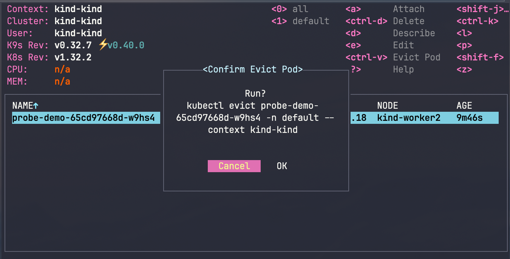

# kubectl-evict

kubectl plugin to evict pods

## Installation

```
go install github.com/Ladicle/kubectl-evict@latest
```

## Usage

```console
> kubectl evict -h
Usage:
  evict <POD_NAME>... [flags]

Flags:
      --cascade string     Propagation policy for deleting the pod. Valid values are 'orphan', 'background' and 'foreground'. (default "background")
      --dry-run            Enable the dray-run option.
      --grace-period int   Period of time in seconds given to the pod to terminate gracefully. Ignored if negative. (default -1)
  -h, --help               help for evict
  -v, --version            version for evict

Use "kubectl options" for a list of global command-line options (applies to all commands).
```

### Use via k9s



Copy [config/k9s/plugins/evict-pod.yaml](config/k9s/plugins/evict-pod.yaml) settings to the `$XDG_CONFIG_HOME/k9s/plugins.yaml` file and restart k9s. You can then evict a pod by pressing `Ctrl-v` on the target pod.
